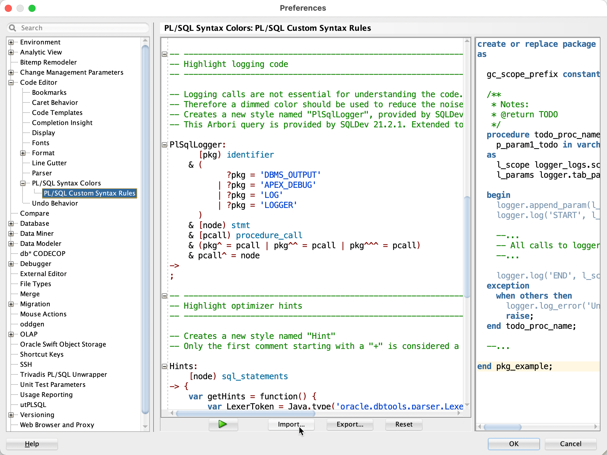

# PL/SQL Syntax Colors for SQL Developer

## Introduction

This repository provides settings for syntax highlighting of PL/SQL & SQL code in [Oracle SQL Developer, Version 21.2.1](https://www.oracle.com/tools/downloads/sqldev-downloads.html).

The alternative Arbori program improves the settings as follows:

- Keywords used as identifiers are highlighted as identifiers.
- Logging calls consider also fully qualified statements are and the final semicolon.
- Distinguish between comments and optimizer hints.

The Arbori program works with any color schema.

## Installation

1. Clone this repository or download the ZIP file and extract it. 
2. Start SQL Developer
3. Open `Preferences`
3. Select `Code Editor` -> `PL/SQL Syntax Colors` -> `PL/SQL Custom Syntax Rules`
4. Press `Import...`
   
5. Select [`trivadis-custom-syntax.arbori`](settings/trivadis-custom-syntax.arbori)
6. Press `Open`
7. Press `OK` to save the settings

# Issues
Please file your bug reports, enhancement requests, questions and other support requests within [Github's issue tracker](https://help.github.com/articles/about-issues/).

* [Questions](https://github.com/Trivadis/plsql-syntax-colors/issues?q=is%3Aissue+label%3Aquestion)
* [Open enhancements](https://github.com/Trivadis/plsql-syntax-colors/issues?q=is%3Aopen+is%3Aissue+label%3Aenhancement)
* [Open bugs](https://github.com/Trivadis/plsql-syntax-colors/issues?q=is%3Aopen+is%3Aissue+label%3Abug)
* [Submit new issue](https://github.com/Trivadis/plsql-syntax-colors/issues/new)

## How to Contribute

1. Describe your idea by [submitting an issue](https://github.com/Trivadis/plsql-syntax-colors/issues/new)
2. [Fork this respository](https://github.com/Trivadis/plsql-syntax-colors/fork)
3. [Create a branch](https://help.github.com/articles/creating-and-deleting-branches-within-your-repository/), commit and publish your changes and enhancements
4. [Create a pull request](https://help.github.com/articles/creating-a-pull-request/)

## License

The Trivadis PL/SQL & SQL Formatter Settings are licensed under the Apache License, Version 2.0. You may obtain a copy of the License at <http://www.apache.org/licenses/LICENSE-2.0>.
