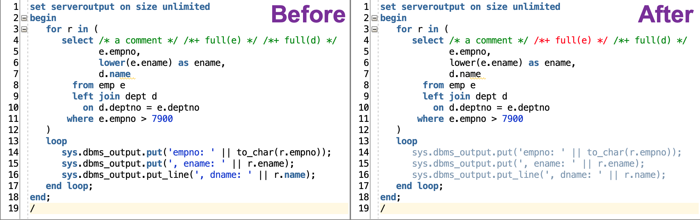

# PL/SQL Syntax Colors for SQL Developer

## Introduction

This repository provides settings for syntax highlighting of PL/SQL & SQL code in [Oracle SQL Developer, Version 21.2.1](https://www.oracle.com/tools/downloads/sqldev-downloads.html).

The alternative Arbori program improves the settings as follows:

- Handle keywords used as identifiers.
- Consider fully qualified logging calls including final semicolon.
- Distinguish between comments and optimizer hints.

The Arbori program works with any color scheme.

## Installation

1. Clone this repository or download the ZIP file and extract it. 
2. Start SQL Developer
3. Open `Preferences`
4. Select `Code Editor` -> `PL/SQL Syntax Colors` -> `PL/SQL Custom Syntax Rules`
5. Press `Import...`
   
6. Select [`trivadis-custom-syntax.arbori`](settings/trivadis-custom-syntax.arbori)
7. Press `Open`
8. Press `OK` to save the settings
9. Restart SQL Developer
10. Open `Preferences`
11. Select `Code Editor` -> `PL/SQL Syntax Colors`
12. Select Style `Hint` and change color settings
13. Press `OK` to save the settings

## License

These settings are licensed under the Apache License, Version 2.0. You may obtain a copy of the License at <http://www.apache.org/licenses/LICENSE-2.0>.
